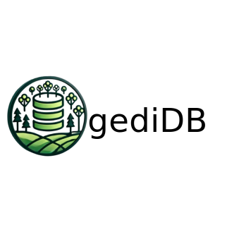

# gediDB: A toolbox for Global Ecosystem Dynamics Investigation (GEDI) L2A-B and L4A-C data

**gediDB** is an open source project and Python
package that makes working with GEDI L2A-B and L4A-C data easy and fun!

**gediDB** is designed to streamline the processing, analysis, and management of GEDI data. The toolbox provides an intuitive interface for handling large volumes of GEDI data, automating the downloading, parsing, and processing of GEDI granules. Built to work efficiently with GEDI’s products, it is tailored for scientists, researchers, and data analysts working in fields like ecology, forestry, remote sensing, and environmental science.

**gediDB** integrates key functionalities such as structured data querying, multi-dimensional data processing, and metadata management. With built-in support for Dask, the toolbox ensures scalability for large datasets, allowing efficient parallel processing on local machines or clusters.

## Key Features of gediDB

- Granule Management: Automatically download and process GEDI granules across different product levels (e.g., L2A, L2B, L4A, L4C) in parallel, ensuring metadata consistency and data quality.
- Flexible Data Querying: Query data from the GEDI database using labeled dimensions such as time, location, and beam name. The SQL-based querying allows for precise data extraction, filtered by various spatial and temporal constraints.
- Parallel Processing with Dask: Seamlessly process large datasets in parallel using Dask, enabling concurrent downloading, processing, and database insertion of GEDI products. The number of concurrent processes can be easily controlled based on system resources.
- Integration with HDF5 and Parquet Formats: The toolbox supports parsing and saving data in both HDF5 and Parquet formats, providing flexibility in managing data storage and retrieval.
- Multi-product Handling: Process multiple products per granule simultaneously, including Level 2 and Level 4 GEDI products, ensuring that data from different sources are handled efficiently.
- Metadata-Driven: Maintain and manage metadata for each dataset, ensuring that important contextual information such as units, descriptions, and source details are stored and accessible.
- Geospatial Data Management: Built-in support for geospatial data types using GeoPandas, allowing seamless spatial queries and operations.

## Why gediDB?
**gediDB** simplifies and automates the workflow of processing GEDI satellite data, reducing manual work and enabling efficient parallel processing for large-scale datasets. Whether you're conducting ecological studies, analyzing biomass data, or investigating land surface dynamics, **gediDB** empowers users with the tools to quickly process and analyze GEDI data.

## Documentation

Learn more about gediDB in its official documentation at
<https://gedi-toolbox.readthedocs.io/en/latest/>.

Try out an [interactive Jupyter
notebook]().

## Contributing

You can find information about contributing to gediDB at our
[Contributing
page](https://docs.gediDB.dev/en/stable/contributing.html).

## History

The development of the GEDI Toolbox began during the PhD of Amelia Holcomb, who initially created the core of this toolset to analyze and manage GEDI (Global Ecosystem Dynamics Investigation) data for her research. Recognizing the potential of her work to benefit the broader scientific community, the [Global Land Monitoring](https://www.gfz-potsdam.de/en/section/remote-sensing-and-geoinformatics/topics/global-land-monitoring) team collaborated in March 2024 with Amelia to expand and optimize her code, transforming it into a scalable and versatile Python package named gediDB. This collaboration helped refine the toolbox to handle large-scale datasets, integrate parallel processing, and incorporate a robust querying and metadata management system. Today, gediDB is designed to empower researchers in ecological and environmental sciences by making GEDI data processing more efficient and accessible.

## Contact person
For any questions or inquiries, please contact Amelia Holcomb (ah2174@cam.ac.uk), Felix Dombrowski (felix.dombrowski@uni-potsdam.de) and Simon Besnard (besnard@gfz-potsdam.de) 

## Acknowledgments
We acknowledge funding support by the European Union through the FORWARDS (https://forwards-project.eu/) and OpenEarthMonitor (https://earthmonitor.org/) projects. We also would like to thank the R2D2 Workshop (March 2024, GFZ. Potsdam) for providing the opportunity to meet and discuss GEDI data processing.

## License
This project is licensed under the EUROPEAN UNION PUBLIC LICENCE v.1.2 License - see the LICENSE file for details.