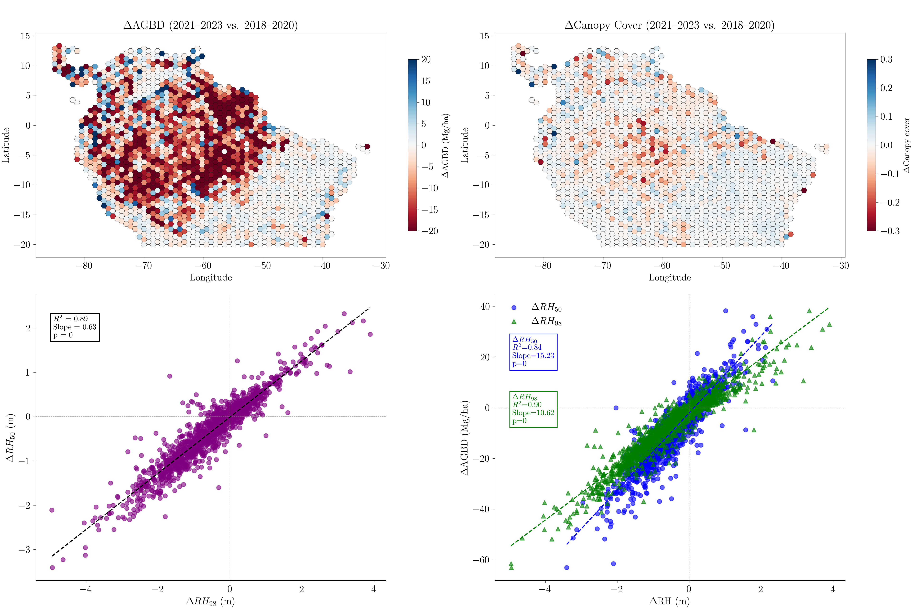

# Abstract

The Global Ecosystem Dynamics Investigation (GEDI) mission provides spaceborne LiDAR observations that are essential for characterising Earth's forest structure and carbon dynamics. However, GEDI datasets are distributed as complex HDF5 granules, which pose significant challenges for efficient, large-scale data processing and analysis. To overcome these hurdles, we developed `gediDB`, an open-source Python standardized Application Programming Interface (API) that streamlines both the processing and querying of GEDI Level 2A–B and Level 4A–C datasets. Built on the optimised multidimensional array database `TileDB`, `gediDB` enables operational-scale processing, rapid spatial and temporal queries, and reproducible LiDAR-based analyses of forest biomass, carbon stocks, and structural change.

# Statement of Need

High-volume LiDAR datasets from the Global Ecosystem Dynamics Investigation (GEDI) mission [@dubayah2020global] ([Fig. 1](#fig1)) have become a key resource for quantifying forest dynamics, estimating biomass, and analysing carbon cycling. The open availability of GEDI's spaceborne LiDAR data has created unprecedented opportunities to extend forest structural analyses from local or regional case studies to near-global scales. However, despite the richness of information contained in GEDI datasets, their practical usability remains challenging due to the complexity of raw HDF5 granules, a lack of scalable infrastructure for efficient data retrieval, and insufficient standardized tools for large-scale spatial and temporal subsetting.

*Fig. 1: A schematic representation of the GEDI data structure. Credits: Amelia Holcomb's PhD dissertation*

Existing software tools for GEDI data analysis, such as the GEDI Subsetter provided by NASA's Multi-Mission Algorithm and Analysis Platform (MAAP) [GEDI Subsetter; @chuck_daniels_2025_15122227], primarily address small to moderate-scale data extraction scenarios. While suitable for interactive or limited spatial extents, these tools often struggle to efficiently support large-scale workflows, leading to computational bottlenecks and decreased efficiency when applied to extensive spatial and temporal analyses.

`gediDB` addresses these limitations by offering a robust and scalable framework that unifies access to GEDI Level 2A [@dubayah2021gedi_l2a], Level 2B [@dubayah2021gedi_l2b], Level 4A [@dubayah2022gedi_l4a] and Level 4C [@deconto2024gedi_l4c] data via an Python [@10.5555/1593511] standardized Application Programming Interface (API). Built on the TileDB storage engine, `gediDB` supports rapid querying of multidimensional arrays, allowing users to efficiently extract large data subsets by spatial extent, temporal range, and variable selection. It integrates seamlessly with Python’s geospatial data ecosystem, including libraries such as `xarray` [@hoyer2017xarray] and `geopandas` [@kelsey_jordahl_2020_3946761], and integrates into reproducible workflows that can scale to high-performance computing environments and cloud platforms. By leveraging TileDB’s advanced spatial indexing, `gediDB` substantially simplifies the processing and querying of GEDI data (see [Fig. 2](#fig2)).

*Fig. 2: A schematic representation of the gediDB data workflow.*

# Core functionalities

Extensive documentation and user tutorials for `gediDB` are available at [https://gedidb.readthedocs.io](https://gedidb.readthedocs.io). These resources provide comprehensive setup instructions, configuration guidance, and workflow examples. Users have immediate access to a globally processed GEDI dataset, eliminating the need for local downloads, as detailed in the [database documentation](https://gedidb.readthedocs.io/en/latest/user/tiledb_database.html).

## Data processing framework

The `gediDB` package is structured around two core modules designed to streamline GEDI data processing and retrieval:

- **`GEDIProcessor`**: Systematically ingests raw GEDI granules and transforms them into structured TileDB arrays ([Fig. 3](#fig3)). Key steps include data filtering, standardisation, and efficient spatio-temporal chunking to ensure optimal query performance.

- **`GEDIProvider`**: Enables rapid, flexible access to GEDI data using spatial bounding boxes, temporal filters, and user-selected variables. Results are provided in formats fully compatible with Python’s geospatial libraries such as `xarray` and `pandas` [@reback2020pandas].

## Configurable and reproducible workflows

`gediDB` uses customisable configuration files to define TileDB schemas and data retrieval parameters. This facilitates reproducibility and adaptability across diverse research scenarios and computing environments.

## Robust data downloading

The API interfaces directly with NASA’s Common Metadata Repository (CMR) to facilitate reliable data acquisition. It incorporates comprehensive retry logic and robust error handling to mitigate issues related to network interruptions or data inconsistencies.

## High-performance data storage

GEDI data is efficiently stored using structured TileDB sparse arrays optimised for rapid spatial and temporal queries. The array structure is specifically designed to handle large-scale, multi-dimensional data seamlessly ([Fig. 3](#fig3)).

## Parallel processing capabilities

Parallelised operations are fully supported, including data downloading, processing, and storage. `gediDB` leverages libraries such as `Dask` [@rocklin2015dask] and Python’s built-in `concurrent.futures` to maximise performance on large-scale workflows and high-performance computing infrastructures.

## Advanced querying functionality

`gediDB` offers sophisticated querying methods, enabling spatial and temporal subsetting through bounding-box, time-range, and nearest-neighbour queries. The system efficiently handles both scalar and profile-type variables.

## Comprehensive metadata management

Rich metadata is systematically captured and managed, including data provenance, variable units, descriptions, and product version details. Metadata is embedded directly within the TileDB structure to facilitate clear data documentation and reproducibility.

*Fig. 3: Illustration of the global GEDI data storage schema using TileDB arrays.*

# Performance benchmarks

The efficiency of `gediDB` was evaluated under realistic research scenarios. The table below summarises query times across different spatial and temporal extents:

| Scenario                  | Spatial extent         | Time range | Variables queried                                  | Query time (seconds) |
|---------------------------|------------------------|------------|----------------------------------------------------|----------------------|
| Local-scale query         | 1° × 1° bounding box   | 1 month    | relative height metrics, canopy cover              | 1.8                  |
| Regional-scale query      | 10° × 10° bounding box | 6 months   | relative height metrics, biomass, plant area index | 17.9                 |
| Continental-scale query   | Amazon Basin           | 1 year     | canopy cover, biomass                              | 28.9                 |

Benchmarks were conducted on a Linux server equipped with dual Intel® Xeon® E5-2643 v4 CPUs (12 physical cores, 24 threads total), 503 GB RAM, and a combination of NVMe SSD (240 GB) and HDD storage (16.4 TB total). Queries were executed from NVMe-backed storage to ensure high I/O performance. Compared to workflows based on direct HDF5 access, `gediDB` provides a significant speedup and streamlined user experience.

# Example use cases

An illustrative use case involved the analysis of aboveground biomass and canopy cover dynamics across the Amazon Basin ([Fig. 4](#fig4)). Leveraging `gediDB`, variables representing aboveground biomass, canopy cover, and vertical canopy structure (i.e., relative height (RH) metrics) were efficiently extracted over large spatial extents and multiple years. The data were aggregated within a 1°×1° hexagonal grid framework, enabling spatiotemporal analysis of forest structure change. Integration with Python’s geospatial libraries, such as `geopandas` and `xarray`, allowed for a fully reproducible workflow from data extraction to visualization. To explore structural drivers of biomass change, a scatter plot analysis compared changes in upper and lower canopy height metrics (ΔRH98 and ΔRH50) with ΔAGBD. The greater slope observed between changes in median canopy height (ΔRH50) and aboveground biomass density (ΔAGBD), compared to changes in upper canopy height (ΔRH98) (lower right panel), indicates that biomass dynamics are more closely linked to widespread structural adjustments across the lower and mid-canopy layers rather than to changes restricted to the tallest forest emergents.

*Fig. 4: Visualisation of changes in aboveground biomass density (AGBD) (top left panel) and canopy cover (top right panel) between 2018–2020 and 2021–2023, aggregated to a 1°×1° hexagonal grid over the Amazon Basin. The bottom left panel shows the relationship between changes in ΔRH50 and ΔRH98, with each point representing a hexagon. The bottom right panel shows the relationship between changes in canopy height metrics (ΔRH50 and ΔRH98) and ΔAGBD, with each point representing a hexagon. This highlights how vertical canopy structure dynamics relate to biomass change across the region.*

Beyond regional change assessments, `gediDB` supports advanced analyses such as biome-level comparisons of forest structural profiles, precise retrieval of GEDI data near field plots for calibration and validation, and the production of spatially gridded datasets at diverse resolutions. Recent studies have leveraged GEDI data to map canopy height across global forested ecosystems [@pauls2024estimatingcanopyheightscale], to assess forest disturbances [@HOLCOMB2024114174], and to characterise forest degradation dynamics [@bourgoin2024human]. These applications demonstrate the potential of GEDI data to inform ecological monitoring and policy development. By streamlining data access, subsetting, and integration into scalable workflows, `gediDB` can significantly enhance the efficiency and reproducibility of such large-scale analyses—supporting efforts like global canopy height mapping, disturbance detection, and forest degradation monitoring.

# Community impact and future development

`gediDB` fosters an open and collaborative research environmentby actively encouraging community-driven development through its [GitHub repository](https://github.com/simonbesnard1/gedidb). Its open-source nature promotes transparency, reproducibility, and long-term accessibility, benefiting a wide range of scientific applications in LiDAR research and environmental analysis.

Planned future developments for `gediDB` include:

- Maintaining compatibility with new GEDI data releases and product updates
- Enhancing performance and flexibility in querying profile variables
- Supporting direct reading of native HDF5 files from AWS S3 buckets
- Expanding tutorials and documentation to reach a broader user base
- Improving the testing framework to ensure greater reliability and maintainability

Feedback, feature requests, and code contributions from users and developers are warmly welcomed. Through sustained community engagement, `gediDB` aims to continually evolve as a robust and adaptable tool for forest remote sensing and ecosystem monitoring.

# Conclusion

`gediDB` substantially improves the practical usability of GEDI LiDAR datasets by addressing key challenges related to data complexity, scalability, and reproducibility. Leveraging TileDB’s optimised multidimensional array storage, it enables efficient data management, fast querying, and seamless integration into diverse geospatial analysis workflows. This empowers the systematic exploration of forest dynamics and carbon cycling at unprecedented spatial and temporal scales. Through its open-source, community-driven design, `gediDB` fosters collaborative progress in remote sensing, ecology, and environmental science, supporting the evolving needs of the Earth observation community.

# Acknowledgements

The development of `gediDB` was supported by the European Union through the FORWARDS and OpenEarthMonitor projects. We would also like to acknowledge the R2D2 Workshop (March 2024, Potsdam) for providing the opportunity to meet and discuss GEDI data processing. We recognise using OpenAI's ChatGPT and Grammarly AI tools to enhance the manuscript's sentence structure, conciseness, and grammatical accuracy.

# References

