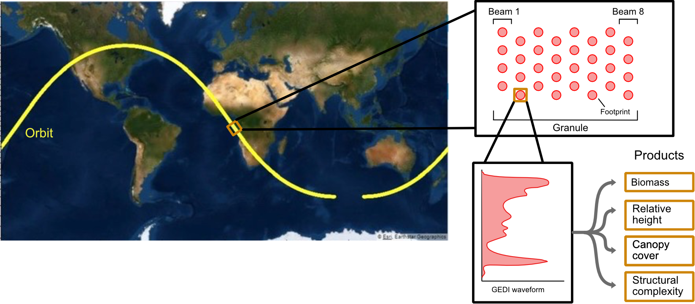
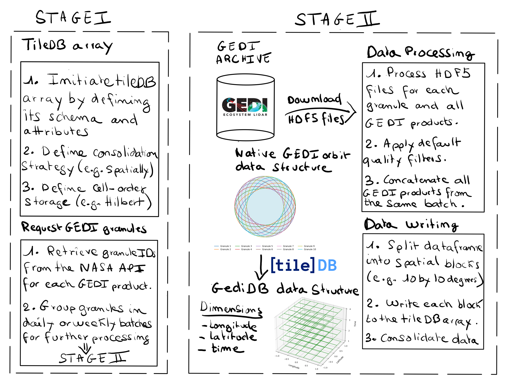
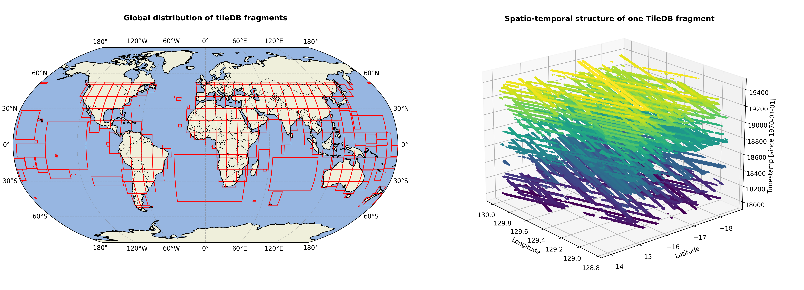

# Abstract

The Global Ecosystem Dynamics Investigation (GEDI) mission provides spaceborne LiDAR observations that are essential for characterising Earth's forest structure and carbon dynamics. However, GEDI datasets are distributed as complex HDF5 granules, which pose significant challenges for efficient, large-scale data processing and analysis. To overcome these hurdles, we developed `gediDB`, an open-source Python standardised Application Programming Interface (API) that streamlines both the processing and querying of GEDI Level 2A–B and Level 4A–C datasets. Built on the optimised multidimensional array database TileDB, `gediDB` enables operational-scale processing, rapid spatial and temporal queries, and reproducible LiDAR-based analyses of forest biomass, carbon stocks, and structural change.


# Statement of Need

High-volume LiDAR datasets from the Global Ecosystem Dynamics Investigation (GEDI) mission [@dubayah2020global] ([Fig. 1](#fig1)) have become essential for quantifying forest dynamics, estimating biomass, and analysing carbon cycling. The open availability of GEDI’s spaceborne LiDAR data has enabled forest structural analysis at near-global scales. However, practical use remains hindered by the complexity of raw HDF5 granules, the absence of scalable infrastructure for efficient access, and a lack of standardised tools for large-scale spatial and temporal subsetting.


*Fig. 1: A schematic representation of the GEDI data structure. Credits: Amelia Holcomb's PhD dissertation [@holcomb_measuring_2025]*

Several efforts in the broader NASA LiDAR community have tackled similar challenges. For example, SlideRule [@Shean2023] provides a scalable, cloud-based framework for processing ICESat-2 photon data, enabling users to query and transform complex satellite LiDAR datasets into analysis-ready forms. This illustrates a common pattern: while raw LiDAR missions deliver highly relevant observations, the data formats and scales make direct scientific use difficult without specialised infrastructure. For GEDI, existing services such as NASA's GEDI Subsetter via the Multi-Mission Algorithm and Analysis Platform (MAAP) [@chuck_daniels_2025_15122227] offer useful access for small to moderate-scale extractions, but they are not designed for operational-scale workflows or integration into reproducible pipelines. Moreover, MAAP introduces two important limitations for many researchers:  

- **Per-product restrictions:** GEDI subsetter requests must be submitted separately for each product (e.g., L2A, L2B, L4A, L4C), even though typical analyses span multiple products. Cross-product filtering is therefore impossible at the query stage.  
- **Access restrictions:** MAAP accounts are limited to researchers affiliated with NASA or ESA projects, whereas `gediDB` is openly accessible to all users.  

`gediDB` addresses this gap by providing a robust, scalable Python-based API for unified access to GEDI Level 2A [@dubayah2021gedi_l2a], 2B [@dubayah2021gedi_l2b], 4A [@dubayah2022gedi_l4a], and 4C [@deconto2024gedi_l4c] products. Built on the TileDB storage engine [@tiledb2025], it enables fast querying of multidimensional arrays by spatial extent, temporal range, and variable selection. Seamless integration with geospatial libraries such as `xarray` [@hoyer2017xarray] and `geopandas` [@kelsey_jordahl_2020_3946761] ensures compatibility with reproducible workflows, from local machines to cloud and high-performance computing environments. By leveraging TileDB’s advanced spatial indexing, `gediDB` simplifies and accelerates GEDI data access and analysis (see [Fig. 2](#fig2)).

The increasing use of GEDI in global applications, such as canopy height mapping [@pauls2024estimatingcanopyheightscale], disturbance assessment [@HOLCOMB2024114174], and forest degradation monitoring [@bourgoin2024human], highlights the need for efficient and scalable tooling. By streamlining data access and enabling large-scale, reproducible workflows, `gediDB` provides a scalable framework for GEDI data analysis, complementing efforts like SlideRule in the ICESat-2 domain and supporting broader ecological monitoring and policy-relevant research.



*Fig. 2: A schematic representation of the gediDB data workflow.*


# Core functionalities

Extensive documentation and tutorials are available at [https://gedidb.readthedocs.io](https://gedidb.readthedocs.io), offering clear setup instructions, configuration guidance, and workflow examples. Users can access a globally processed GEDI dataset directly, avoiding the need for local downloads, as detailed in the [database documentation](https://gedidb.readthedocs.io/en/latest/user/tiledb_database.html).

## Data processing framework

The `gediDB` package centres on two primary modules that streamline GEDI data ingestion and access:

- **`GEDIProcessor`**: Ingests raw GEDI granules and transforms them into structured TileDB arrays ([Fig. 3](#fig3)). The process includes filtering, standardisation, and spatio-temporal chunking to ensure high-performance querying.

- **`GEDIProvider`**: Enables flexible access to GEDI data using spatial and temporal filters and variable selection. Output is compatible with Python libraries such as `xarray` and `pandas` [@reback2020pandas].

## Configurable and reproducible workflows

Custom configuration files define the TileDB schema and data retrieval parameters, supporting reproducibility and adaptability across diverse computing environments.

## Robust data downloading

The API connects directly to NASA’s Common Metadata Repository (CMR) and includes robust retry logic and error handling to ensure consistent, fault-tolerant data acquisition.

## High-performance data storage

GEDI observations are inherently sparse: laser footprints sample only a tiny fraction of the Earth’s surface, with large gaps between adjacent shots. To efficiently represent this irregular structure, `gediDB` stores all products as **sparse TileDB arrays**, in which only the observed footprints are written to disk. This avoids the overhead of dense raster storage while still allowing fast spatial and temporal queries. The sparse array model scales to global, multi-terabyte datasets while keeping storage compact and query performance high ([Fig. 3](#fig3)).

## Parallel processing capabilities

`gediDB` supports parallelised downloading, processing, and storage using libraries such as `Dask` [@rocklin2015dask] and `concurrent.futures`, enabling high-throughput workflows on HPC systems.

## Advanced querying functionality

`gediDB` offers flexible querying capabilities, including bounding-box, temporal range, and nearest-neighbour queries. Both scalar and profile-type variables are supported.

## Rich metadata integration

Comprehensive metadata, covering provenance, units, variable descriptions, and versioning, is embedded within the TileDB arrays, ensuring transparency and reproducibility.


*Fig. 3: Illustration of the global GEDI data storage schema using TileDB arrays.*


# Performance benchmarks

To evaluate the efficiency of `gediDB`, we benchmarked spatiotemporal select queries against two alternatives:  

1. **NASA's GEDI Subsetter** on the MAAP, which reads GEDI products directly as HDF5 from LPDAAC's S3 bucket using temporary AWS credentials, rather than operating on a preprocessed copy of the data.    
2. **A single-server PostGIS instance** hosting the GEDI data, following the approach in [Holcomb, 2023](https://github.com/ameliaholcomb/gedi-database). Postgres cannot be sharded across multiple servers, so while it may be a good option for users with only one machine, it does not achieve the speeds of a distributed database like TileDB.  

This comparison highlights both absolute performance and practical trade-offs between the three approaches.  

| Scenario                | Spatial extent         | Time range | Variables queried                                  | Query time (`gediDB`) | Query time (MAAP) | Query time (PostGIS) |
|-------------------------|------------------------|------------|----------------------------------------------------|-----------------------|-------------------|----------------------|
| Local-scale query       | 1° × 1° bounding box   | 1 month    | relative height metrics, canopy cover              | 1.8 s                 | 51 s              | 5.0 s                |
| Regional-scale query    | 10° × 10° bounding box | 6 months   | relative height metrics, biomass, plant area index | 17.9 s                | 3,037 s           | 596.6 s              |
| Continental-scale query | Amazon Basin           | 1 year     | canopy cover, biomass                              | 28.9 s                | 17,917 s          | 4,812.9 s            |

**Benchmark setup**  
- **gediDB:** Client machine: Linux server with dual Intel® Xeon® E5-2643 v4 CPUs (12 cores, 24 threads), 503 GB RAM, and local NVMe SSD (240 GB) + HDD (16.4 TB) storage. Queries were executed against GEDI data stored in a Ceph object storage cluster (version Quincy) comprising 18× DELL R7515 nodes, each with 11-18× 18-20 TB Seagate data drives and 1× 1.6 TB NVMe (metadata). 
- **gediDB:** Linux server with dual Intel® Xeon® E5-2643 v4 CPUs (12 cores, 24 threads), 503 GB RAM, and NVMe SSD (240 GB) + HDD (16.4 TB) storage. Queries ran on NVMe-backed data to ensure high I/O throughput.  
- **MAAP + GEDI Subsetter:** version 0.12.0 running on `maap-dps-worker-32gb`. Because the subsetter requires each product to be queried separately, per-product jobs were initiated in parallel, and the benchmark time is the longest runtime of any individual product (excluding queueing time).  
- **PostGIS:** version 14, hosted on a server with 4× 3.84 TB SATA SSDs (software RAID), two 18-core dual-threaded Intel® Xeon® CPU E5-2695 v4 @ 2.10GHz, and 512 GB RAM.  

**Interpretation**  
These benchmarks demonstrate that `gediDB` consistently outperforms both MAAP and PostGIS across local, regional, and continental queries. The difference is most pronounced at larger scales: for the Amazon Basin, `gediDB` returns results in under 30 seconds, compared to ~1.3 hours with PostGIS and nearly 5 hours with MAAP. 


# Example use cases

We use `gediDB` to analyse aboveground biomass and canopy cover dynamics across the Amazon Basin ([Fig. 4](#fig4)). The workflow extracts variables including aboveground biomass, canopy cover, and relative height (RH) metrics across large spatial extents and multiple years. Data are aggregated within a 2°×2° hexagonal grid to support spatiotemporal analysis of forest structural change. The analysis pipeline is implemented entirely in Python using `geopandas` and `xarray`, making it fully reproducible from data extraction to visualisation.  

A key advantage of `gediDB` is that large-scale extractions can be performed directly within Python workflows, eliminating the need for manual downloads or interactive tools such as MAAP. Unlike the GEDI Subsetter, which requires per-product queries and does not support multi-product filtering, `gediDB` allows unified access across Level 2A, 2B, 4A, and 4C products in a single query.  

For example, the following snippet demonstrates how GEDI variables can be retrieved for the Amazon Basin as an `xarray.Dataset`:  

```python
import geopandas as gpd
import gedidb as gdb

# Instantiate provider with S3 backend
provider = gdb.GEDIProvider(
    storage_type="s3",
    s3_bucket="dog.gedidb.gedi-l2-l4-v002",
    url="https://s3.gfz-potsdam.de"
)

# Load region of interest (Amazon Basin)
roi = gpd.read_file("amazon_basin.geojson")

# Query GEDI data as xarray dataset
ds = provider.get_data(
    variables=["agbd", "cover", "rh_98", "rh_50"],
    query_type="bounding_box",
    geometry=roi,
    start_time="2018-01-01",
    end_time="2024-01-01",
    return_type="xarray"
)
```


# Future development

Planned future developments for `gediDB` are designed to improve usability and extend the package’s scope for both researchers and operational users:

- **Compatibility with upcoming GEDI product releases**: ensures long-term sustainability of the toolbox as new mission data become available, avoiding version lock-in for users building workflows on `gediDB`.  

- **Improved performance and flexibility in querying profile variables**: will make it easier for users to analyse canopy structure profiles (e.g., RH metrics) at scale, which are currently among the most data-intensive GEDI products.  

- **Support for direct HDF5 access from AWS S3**: will enable `gediDB` to operate directly on cloud-hosted GEDI granules (e.g., on NASA’s MAAP infrastructure), avoiding the need for local downloads and reducing storage overhead. This work corresponds to [Issue #15](https://github.com/simonbesnard1/gedidb/issues/15) (“Allow direct h5 read w/o download”), which aims to let the `GEDIProcessor` access HDF5 files in an S3 bucket without intermediate steps.  

- **Expanded documentation and tutorials**: will benefit new users by lowering the entry barrier, providing clear end-to-end examples, and connecting scientific use cases to code snippets.  

- **Strengthened testing for reliability and maintainability**: supports developers and long-term users by ensuring that changes do not break existing workflows, and by increasing trust in the reproducibility of analyses built on `gediDB`.  

Development progress and discussion of these features are tracked openly through the project’s [GitHub issues](https://github.com/your-org/gedidb/issues) and roadmap.


# Conclusion

`gediDB` improves the usability of GEDI LiDAR datasets by removing key barriers of data complexity, scalability, and reproducibility. By representing GEDI products as sparse multidimensional arrays in TileDB, it enables fast, flexible queries across space, time, and variables, and integrates seamlessly into established geospatial workflows. This allows researchers to perform analyses that extend from local case studies to continental-scale assessments of forest dynamics and the carbon cycle. As an open-source and community-driven project, `gediDB` provides a sustainable framework for large-scale exploitation of spaceborne LiDAR data in remote sensing and environmental science.


# Acknowledgements

The development of `gediDB` was supported by the European Union through the [FORWARDS](https://forwards-project.eu/) and [NextGenCarbon](https://www.nextgencarbon-project.eu/) projects, and by the Helmholtz Association via the Helmholtz Foundation Model Initiative ([3D-ABC project](https://www.3d-abc.ai/)). AC acknowledges funding from the Harding Distinguished Postgraduate Scholarship. We are grateful to participants of the R2D2 Workshop (March 2024, Potsdam) for valuable discussions on GEDI data processing that helped shape this work. We also acknowledge the use of language-assistance tools (OpenAI ChatGPT and Grammarly) to improve readability and grammar. The design, conceptualisation, and scientific results of this work are entirely those of the authors.


# References


