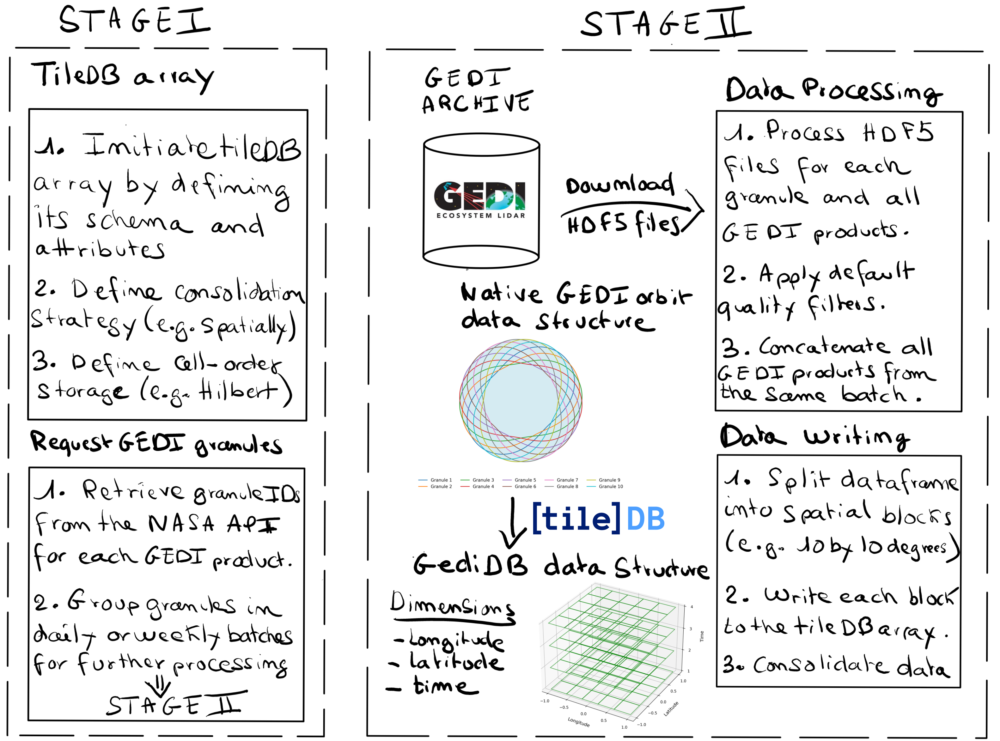

# Abstract

The Global Ecosystem Dynamics Investigation (GEDI) mission ([Fig. 1](#fig1)) provides spaceborne LiDAR observations critical for understanding Earth's forest structure and carbon dynamics. However, GEDI datasets, structured as HDF5 granules, are inherently complex and challenging to efficiently process for large-scale analyses. To facilitate operational processing and large-scale querying of GEDI data, we developed `gediDB`, an open-source Python toolbox that restructures and manages GEDI Level 2A-B and Level 4A-C data using `TileDB`, an optimized multidimensional array database. `gediDB` significantly enhances the efficiency and scalability of GEDI data analysis, enabling rapid spatial and temporal queries and fostering reproducible workflows in forestry, ecology, and environmental research.

*Fig. 1: A schematic representation of the GEDI data structure. Credits: Amelia Holcomb's PhD dissertation*

# Statement of need

High-volume GEDI LiDAR data are essential for studying forest dynamics, biomass estimation, and carbon cycling. Yet, traditional workflows involving raw GEDI HDF5 granules are heavy due to the substantial overhead of file management, preprocessing, and querying over large geographic extents. Researchers and practitioners need accessible, streamlined solutions for retrieving spatially and temporally explicit subsets of GEDI data without the computational burden typically associated with handling raw granules. `gediDB` addresses this critical gap by providing an efficient, scalable framework that leverages spatial indexing through TileDB, significantly simplifying and accelerating data handling (see [Fig. 2](#fig2)).

*Fig. 2: A schematic representation of the gediDB data workflow.*

# Core functionalities

`gediDB` provides:

- **High-performance data storage**: Efficiently stores GEDI data using TileDB, optimized for rapid multidimensional data access. A global schema is used to manage all granules, chunked by space and time ([Fig. 3](#fig3)).

- **Parallel processing capabilities**: Seamless integration with Dask for parallel downloading, processing, and storage of large GEDI datasets.

- **Advanced querying interface**: Enables spatial bounding-box queries, temporal range selections, and nearest-neighbor retrieval (e.g., all GEDI footprints within 50 km of a research plot). Supports both scalar and profile-type variables in harmonized queries.

- **Robust data downloading**: Reliable modules for downloading from NASA's Common Metadata Repository (CMR), with built-in retry and error handling mechanisms.

- **Comprehensive metadata management**: Tracks data provenance, units, variable descriptions, and product versioning within the TileDB arrays.

- **Configurable and reproducible workflows**: Uses customizable configuration files for managing TileDB schemas and data retrieval parameters, ensuring adaptable database structure.

*Fig. 3: Illustration of the global GEDI data storage schema using TileDB arrays.*

# Performance benchmarks

The efficiency of `gediDB` was rigorously evaluated under realistic research scenarios. The table below summarizes query times across different spatial and temporal extents:

| Scenario                  | Spatial extent         | Time range | Variables queried           | Query time (seconds) |
|---------------------------|------------------------|------------|-----------------------------|----------------------|
| Local-scale query         | 1° × 1° bounding box   | 1 month    | rh profile, canopy_cover    | 1.8                  |
| Regional-scale query      | 10° × 10° bounding box | 6 months   | rh profile, biomass, pai    | 17.9                 |
| Continental-scale query   | Amazon Basin           | 1 year     | canopy_cover, biomass       | 28.9                 |

Benchmarks were conducted on a Linux server equipped with dual Intel® Xeon® E5-2643 v4 CPUs (12 physical cores, 24 threads total), 503 GB RAM, and a combination of NVMe SSD (240 GB) and HDD storage (16.4 TB total). Queries were executed from NVMe-backed storage to ensure high I/O performance. Compared to workflows based on direct HDF5 access, `gediDB` provides a significant speedup and streamlined user experience.

# Example use cases

An illustrative application involved analyzing aboveground biomass and canopy cover changes across a subset of the Amazon Basin ([Fig. 4](#fig4)). Using `gediDB`, aboveground biomass and canopy cover variables were rapidly extracted for a multi-year, large-area extent. Data were aggregated within a 1°×1° hexagonal grid to enable spatiotemporal analysis of forest structure dynamics. The integration with Python tools such as `geopandas`, `xarray`, and `matplotlib` facilitated an end-to-end workflow from extraction to visualization.

*Fig. 4: Visualization of changes in aboveground biomass density (AGBD) and canopy cover between 2018–2020 and 2021–2023, aggregated to a 1°×1° hexagonal grid over a subset of the Amazon Basin.*

# Community impact and future development

`gediDB` aims to foster a collaborative, community-driven environment. The project is actively developed and welcomes contributions via [GitHub](https://github.com/simonbesnard1/gedidb). Planned enhancements include:

- Support for future GEDI releases and product updates
- Expanded multi-threaded and cloud-compatible processing
- Additional tutorials and workflows for new user communities

We encourage feedback, feature requests, and pull requests from users and developers working with LiDAR and large-scale environmental data.

# Acknowledgements

The development of `gediDB` was supported by the European Union through the FORWARDS and OpenEarthMonitor projects. We gratefully acknowledge discussions and contributions from participants of the R2D2 Workshop at GFZ Potsdam (March 2024).
