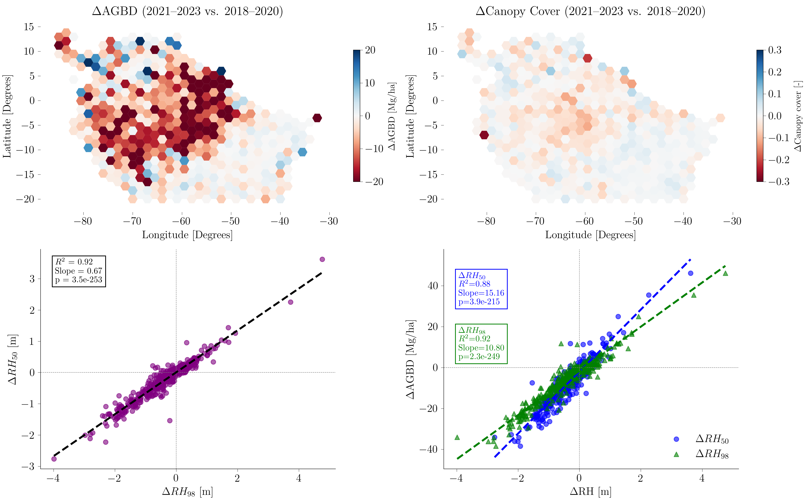

# Abstract

The Global Ecosystem Dynamics Investigation (GEDI) mission ([Fig. 1](#fig1)) provides spaceborne LiDAR observations that are essential for characterising Earth's forest structure and carbon dynamics. However, GEDI datasets are distributed as complex HDF5 granules, which pose significant challenges for efficient, large-scale data processing and analysis. To overcome these hurdles, we developed `gediDB`, an open-source Python toolbox that streamlines both the processing and querying of GEDI Level 2A–B and Level 4A–C datasets. Built on the optimised multidimensional array database `TileDB`, `gediDB` enables operational-scale processing, rapid spatial and temporal queries, and reproducible LiDAR-based analyses of forest biomass, carbon stocks, and structural change.

*Fig. 1: A schematic representation of the GEDI data structure. Credits: Amelia Holcomb's PhD dissertation*

# Statement of need

High-volume LiDAR datasets from the GEDI mission [@dubayah2020global] have become a key resource for quantifying forest dynamics, estimating biomass, and analysing carbon cycling. The open availability of spaceborne GEDI LiDAR data has created unprecedented opportunities to extend forest structural analyses from local or regional case studies to near-global scales. However, despite the richness of information contained in GEDI datasets, their practical usability is hindered by the complexity of raw HDF5 granules, the lack of scalable infrastructure for efficient data retrieval, and the absence of standardised tooling for large-scale spatial and temporal subsetting.

Existing software tools for GEDI data analysis are typically designed for small-scale or isolated use cases and are generally inadequate for handling large, automated workflows. As a result, researchers undertaking extensive spatial and temporal analyses often face considerable challenges related to computational performance, methodological consistency, and reproducibility.

`gediDB` addresses these limitations by offering a robust and scalable framework that unifies access to GEDI Level 2A [@dubayah2021gedi_l2a], 2B [@dubayah2021gedi_l2b], 4A [@dubayah2022gedi_l4a] and 4C [@deconto2024gedi_l4c] data via an Python [@10.5555/1593511] API. Built on the TileDB storage engine, `gediDB` supports rapid querying of multidimensional arrays, allowing users to efficiently extract large data subsets by spatial extent, temporal range, and variable selection. It integrates seamlessly with Python’s geospatial data ecosystem, including libraries such as `xarray` [@hoyer2017xarray] and `geopandas` [@kelsey_jordahl_2020_3946761], and integrates into reproducible workflows that can scale to high-performance computing environments and cloud platforms. By leveraging TileDB’s advanced spatial indexing, `gediDB` substantially simplifies the processing and querying of GEDI data (see [Fig. 2](#fig2)).

*Fig. 2: A schematic representation of the gediDB data workflow.*

# Core functionalities

Extensive documentation and user tutorials for `gediDB` are available at https://gedidb.readthedocs.io. These provide comprehensive setup instructions, configuration guidance, and workflow examples. Users have immediate access to a globally processed GEDI dataset via TileDB, eliminating the need for local downloads, as detailed in the [database documentation](https://gedidb.readthedocs.io/en/latest/user/tiledb_database.html).

`gediDB` is structured around two core modules: [`GEDIProcessor`](https://gedidb.readthedocs.io/en/latest/user/fundamentals.processor.html) and [`GEDIProvider`](https://gedidb.readthedocs.io/en/latest/user/fundamentals.provider.html). The `GEDIProcessor` class systematically ingests and transforms raw GEDI granules into structured TileDB arrays ([Fig. 3](#fig3)), incorporating essential steps such as data filtering, standardisation, and spatio-temporal chunking. The `GEDIProvider` class enables fast, flexible data access through spatial bounding boxes, temporal filters, and variable selection, returning results compatible with Python’s geospatial libraries (e.g., `xarray`, `pandas` [@reback2020pandas]).

Key functionalities of `gediDB` include:

- **Configurable and Reproducible Workflows**: Customisable configuration files define TileDB schemas and data retrieval parameters, supporting reproducible workflows across diverse research contexts.

- **Robust Data Downloading**: Interfaces with NASA’s Common Metadata Repository (CMR) and includes retry logic and comprehensive error handling for reliable data acquisition.

- **High-performance Data Storage**: Manages GEDI data using globally structured TileDB arrays optimised for spatial and temporal access ([Fig. 3](#fig3)).

- **Parallel Processing Capabilities**:  Supports parallelised downloading, processing, and storage using `Dask` [@rocklin2015dask] and `concurrent.futures`, optimised for large-scale GEDI data workflows.

- **Advanced Querying**: Supports spatial and temporal subsetting, including bounding-box, time-range, and nearest-neighbour queries. Handles both scalar and profile-type variables seamlessly.

- **Comprehensive Metadata Management**: Captures rich metadata including data provenance, units, variable descriptions, and product versions within the TileDB structure.

*Fig. 3: Illustration of the global GEDI data storage schema using TileDB arrays.*

# Performance benchmarks

The efficiency of `gediDB` was evaluated under realistic research scenarios. The table below summarises query times across different spatial and temporal extents:

| Scenario                  | Spatial extent         | Time range | Variables queried           | Query time (seconds) |
|---------------------------|------------------------|------------|-----------------------------|----------------------|
| Local-scale query         | 1° × 1° bounding box   | 1 month    | rh profile, canopy cover    | 1.8                  |
| Regional-scale query      | 10° × 10° bounding box | 6 months   | rh profile, biomass, pai    | 17.9                 |
| Continental-scale query   | Amazon Basin           | 1 year     | canopy cover, biomass       | 28.9                 |

Benchmarks were conducted on a Linux server equipped with dual Intel® Xeon® E5-2643 v4 CPUs (12 physical cores, 24 threads total), 503 GB RAM, and a combination of NVMe SSD (240 GB) and HDD storage (16.4 TB total). Queries were executed from NVMe-backed storage to ensure high I/O performance. Compared to workflows based on direct HDF5 access, `gediDB` provides a significant speedup and streamlined user experience.

# Example use cases

An illustrative use case involved the analysis of aboveground biomass and canopy cover dynamics across the Amazon Basin ([Fig. 4](#fig4)). Utilising `gediDB`, variables representing aboveground biomass and canopy cover were efficiently extracted across large spatial extents over multiple years. Data were aggregated within a 1°×1° hexagonal grid framework, facilitating spatiotemporal analysis of forest structure changes. Integration with Python's geospatial libraries, such as `geopandas` and `xarray` enabled a complete and reproducible workflow from data extraction to visualisation.

*Fig. 4: Visualisation of changes in aboveground biomass density (AGBD) and canopy cover between 2018–2020 and 2021–2023, aggregated to a 1°×1° hexagonal grid over the Amazon Basin.*

Beyond regional change assessments, `gediDB` supports advanced analyses, including biome-level comparisons of forest structural profiles, 
precise retrieval of GEDI data near field plots for calibration and validation, and the production of spatially gridded datasets at diverse resolutions. The modular and extensible API facilitates seamless integration into cloud-based processing pipelines, long-term ecological monitoring programs, and machine learning workflows that necessitate scalable, high-performance access to the global GEDI data archive.

# Community impact and future development

`gediDB` fosters an open and collaborative research environment, actively encouraging community-driven development and contributions via its [GitHub repository](https://github.com/simonbesnard1/gedidb). Its open-source nature promotes transparency, reproducibility, and long-term accessibility, supporting a wide range of scientific applications in LiDAR research and large-scale environmental analysis.

Planned future developments for `gediDB` include:

- Continued compatibility with upcoming GEDI data releases and product updates
- Expanded tutorials and documentation to better serve a broader user base
- Improved testing frameworks for enhanced reliability and maintainability
- Greater flexibility and performance in querying profile variables
- Support for direct reading of native HDF5 files from the AWS S3 bucket

Feedback, feature requests, and code contributions are warmly welcomed from users and developers. Through sustained community engagement, `gediDB` aims to evolve as a robust, adaptable tool for forest remote sensing and ecosystem monitoring.

# Conclusion

`gediDB` substantially significantly improves the practical usability of GEDI LiDAR datasets by addressing key challenges related to data complexity, scalability, and reproducibility. Leveraging TileDB’s optimised multidimensional array storage, it enables efficient data management, fast querying, and seamless integration into diverse geospatial analysis workflows. This empowers the systematic exploration of forest dynamics and carbon cycling at unprecedented spatial and temporal scales. Through its open-source, community-driven design, `gediDB` fosters collaborative progress in remote sensing, ecology, and environmental science, supporting the evolving needs of the Earth observation community.

# Acknowledgements

The development of `gediDB` was supported by the European Union through the FORWARDS and OpenEarthMonitor projects. We would also like to acknowledge the R2D2 Workshop (March 2024, Potsdam) for providing the opportunity to meet and discuss GEDI data processing.

# References

